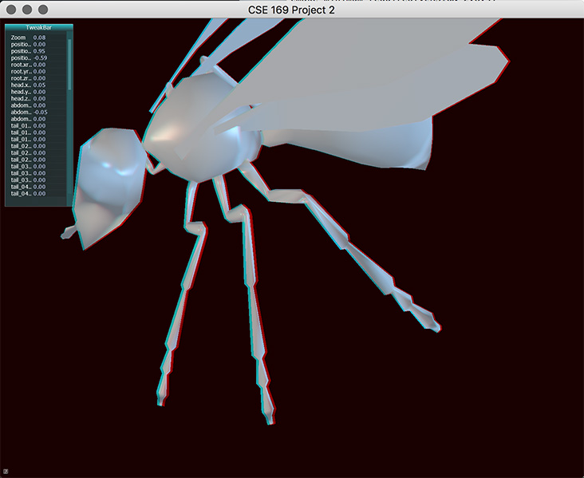

# Skeletal Animation

This is a project I built for a graphics course. Play an animated mesh and observe the weights at each joint.



## Features

- Stereo anaglyph rendering
- Key-framed skeletal animation
- Skinned models

## Building

GLFW3 is required. A binary for macOS is included in the repo.

The CMake was only tested macOS. The libraries may need to be modified on other platforms.

To build on macOS:
```
mkdir build
cd build
cmake ..
cmake --build . --target install
```

## Controls

Drag with mouse to rotate view. Scroll to zoom in/out.

- *ESC* - exit 
- *Q* - toggle back-face culling
- *W* - toggle wireframe rendering
- *R* - reverse animation direction
- *A* - toggle playback
- *S* - toggle skeleton/mesh rendering 

## Authors

Trevor Smith - [LinkedIn](https://linkedin.com/in/trevorsm/)
